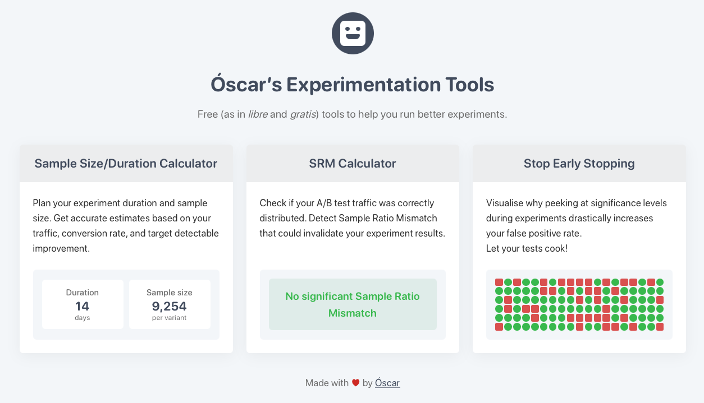

    
    
    
     
    
    <a href="https://ab.osc.garden">Visit it!</a>
     

A landing page for my free (as in freedom) experimentation tools.

## Featured tools

- **[A/B Test Sample Size & Duration Calculator](https://calculator.osc.garden)**: Plan experiment duration and sample size.
- **[Sample Ratio Mismatch Calculator](https://srm.osc.garden)**: Check if A/B test traffic was correctly distributed.
- **[Stop Early Stopping](https://stop-early-stopping.osc.garden)**: Visualise why peeking at significance levels during experiments is a bad idea.

## Contributing

If you found any issues, feel free to report them or fix them!

This landing page uses vanilla HTML, CSS, and JavaScript. To run locally:

1. Clone the repository: `git clone https://github.com/welpo/experimentation-tools.git`
2. Navigate to the project directory: `cd experimentation-tools`
3. Start a local server: `python3 -m http.server`
4. Visit `http://localhost:8000` in your browser

The important files are:

- `index.html`: page structure and content
- `styles.css`: styling
- `robot.js`: animations for the robot

## License

This landing page is free software: you can redistribute it and/or modify it under the terms of the [GNU Affero General Public License as published by the Free Software Foundation](./COPYING), either version 3 of the License, or (at your option) any later version.
